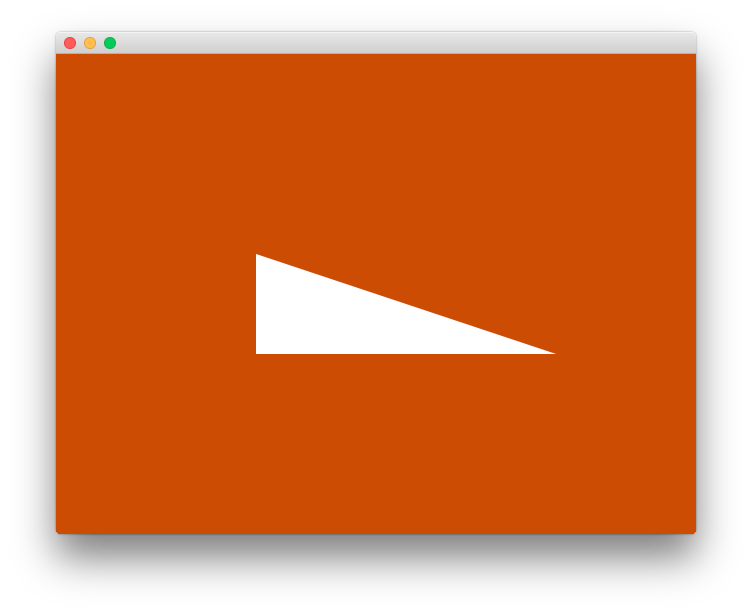

# goxjs Examples [](https://travis-ci.org/goxjs/example) [](https://godoc.org/github.com/goxjs/example)

Example projects for goxjs packages.

## triangle

Render a basic triangle.

```bash
go get -u github.com/goxjs/example/triangle
```



## motionblur

Render a square with and without motion blur.

```bash
go get -u github.com/goxjs/example/motionblur
```


License
-------

-	[MIT License](https://opensource.org/licenses/mit-license.php)
