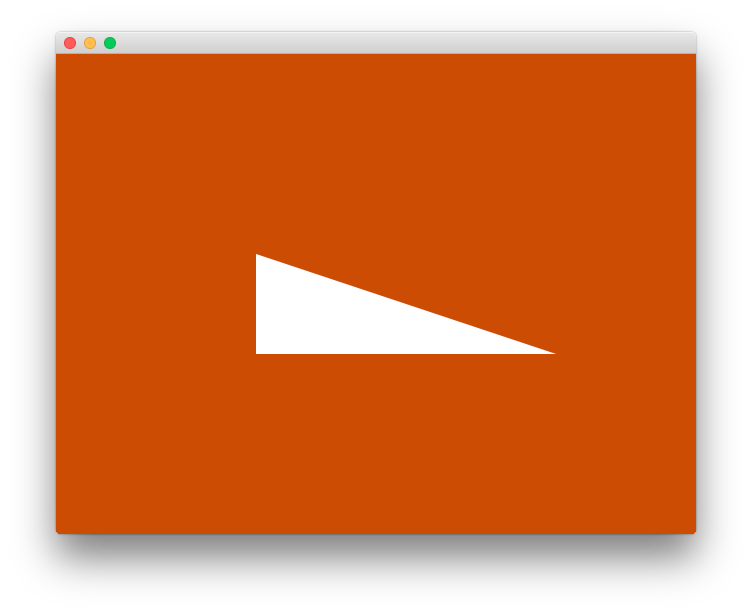
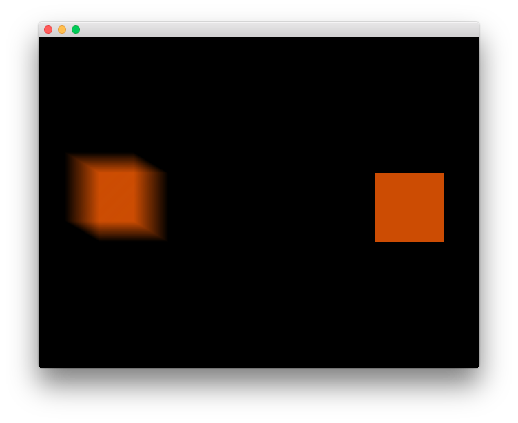

goxjs Examples
==============

[](https://pkg.go.dev/github.com/goxjs/example)

Example projects for goxjs packages.

## triangle

Render a basic triangle.

```sh
go run github.com/goxjs/example/triangle@latest
```



## motionblur

Render a square with and without motion blur.

```sh
go run github.com/goxjs/example/motionblur@latest
```

Also try [in browser](https://dmitri.shuralyov.com/projects/MotionBlurDemo/MotionBlurDemo.html).



License
-------

-	[MIT License](LICENSE)
